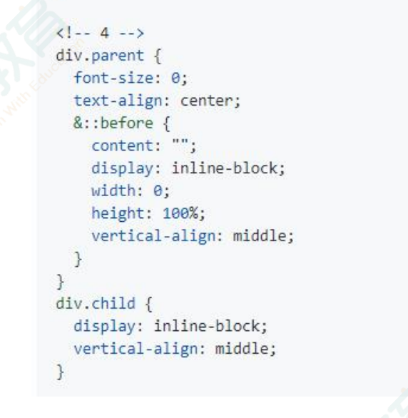

定宽高
- absolute+负margin
- absolute+margin auto
- absolute+calc
不定宽高
- absolute+transform
- lineheight
- writing-mode
- table
- css-table
- flex
- grid
## absolute+负margin
```html
<div class="father">
  <div class="son"></div>
</div>
```
```css
.father {
  position: relative;
}
.son {
  position: absolute;
  left: 50%;
  top: 50%;
  margin-left: -(父元素宽度-子元素宽度)/2 px;
  margin-top: -(父元素高度-子元素高度)/2 px;
}
```
## absolute+auto
```html
<div class="father">
  <div class="son"></div>
</div>
```
```css
   .father{
      position: relative;
      width: 200px;
      height: 200px;
      background-color: red;
    }
    .son{
      background-color: black;
      position: absolute;
      width: 100px;
      height: 100px;
      left: 0;
      right: 0;
      top: 0;
      bottom: 0;
      margin: auto;
    }
```
## absolute+cale
```html
<div class="father">
  <div class="son"></div>
</div>
```
```css
.father {
  width: 200px;
  height: 200px;
  position: relative;
}
.son {
    width: 100px;
      height: 100px;
  position: absolute;
  top:cale(50% - 50px);
  left:cale(50% - 50px);
}
```
## absollute+transform
```css
.father {
  position: relative;
}
.son {
  position: absolute;
  left: 50%;
  top: 50%;
  transform: translate(-50%, -50%);
}
```

## flex

```css
.father {
  display: flex;
  justify-content: center;
  align-items: center;
}
```

## grid

```css
.father {
  display: grid;
}
.son {
  justify-self: center;
  align-self: center;
}
```



## 参考内容

- [grid 布局-阮一峰](https://www.ruanyifeng.com/blog/2019/03/grid-layout-tutorial.html)
- [CSS实现水平垂直居中的10种方式](https://juejin.cn/post/6844903679242305544?searchId=20230909222658C6F9D6A4FAD1A9C911AC)