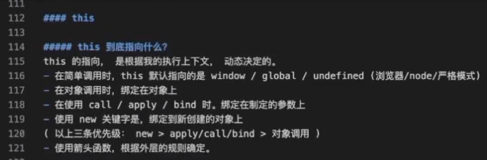

## 定义

执行上下文

## this 指向

- 简单调用时，this 指向全局
- 严格模式时，this 指向 undefined
- 对象调用方法时，方法的 this 指向调用的对象
- 使用 call、apply、bind 时，this 指向指定的对象
- 使用 new 关键字时，this 指向创建的对象
- new>call|apply|bind>调用

## 如何改变 this 指向

call、apply、bind

2. (来源爪哇)

## 参考

- 爪哇教育
  
