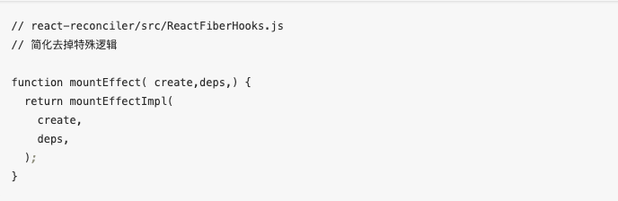

## 定义
在JavaScript中，根据词法作用域的规则，内部函数总是可以返佣其外部函数声明的变量，当通过调用一个外部函数返回一个内部函数后，即使其外部函数已经执行结束，但是内部函数引用外部函数的变量依然保存在内存中，我们就把这些变量的集合称为必包。
```js
function fn1(){
  var a = 1;
  return function fn2(){
    console.log(a++);
  }
}
var fn = fn1();
fn();//1
fn();//2
```
## 必包的设计解决了什么问题
动态作用域难以模块化的问题
## 必包优缺点

### 优点
- 保护私有变量，避免全局污染
- 延长变量生命周期
- 实现模块化
- 保持状态
### 缺点
- 内存占用
- 性能损耗：涉及到作用域链查找过程


## 必包怎么回收
如果必包引用的函数是全局变量，那么必包会一直存在到页面关闭，如果这个必包以后不在使用的话，就会造成内存泄露
如果这个必包引用的是局部变量，等函数销毁后，在下次JavaScript引擎执行垃圾回收时，判断必包这块内容如果不再被使用了，那么Javascript引擎垃圾回收器就会回收这块内存
## 应用场景
- for循环
- 封装私有变量和函数
- 模块化实现
- 实现高阶函数
- 实现回调函数
- 模拟块级作用域
- React Hook
### for循环
```js
for(var i = 0; i < 9; i++){
  (function(i){
    console.log(i);
  })(i)
}
```
### 封装私有变量和函数
```js
function createPerson(){
  var _name;
  return {
    getName:function(){
      return _name;
    },
    setName:function(name){
      _name = name;
    }
  }
}
var lwp=createPerson();
lwp.setName('兰为鹏')
console.log(lwp.getName())//兰为鹏
```
### 模块化实现
```js
(function(){
  function add(a, b){
    return a + b;
  }
  function sub(a, b){
    return a - b;
  }
  globalThis.countFn={
    add:add,
    sub:sub
  }
})();
var sum=countFn.add(1,2);
console.log(sum)
```
### 实现高阶函数
```js
function addBy(a){
  return function(b){
    return a + b;
  }
}
var addTwo = addBy(2);
console.log(addTwo(5))
```
### 实现回调函数
```js
function getNameAync(cb){
  setTimeout(()=>{
    cb && cb('lwp');
  },2000)
}
getNameAync((name)=>{
  console.log(name);
})
```
### React Hook

## 参考
- 李兵《浏览器工作原理与实践》
- https://juejin.cn/post/7264183910597279799?searchId=20230811115704AA7D2C45DAE9128A9798
- https://blog.csdn.net/My_Soul_/article/details/128791949
- [React Hook实现](https://juejin.cn/post/6844904080758800392?searchId=20230811141248B205BC414DCA1B9B04D0)