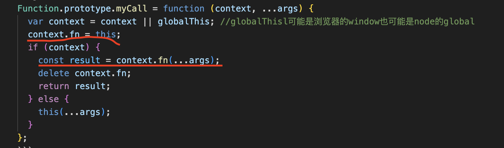
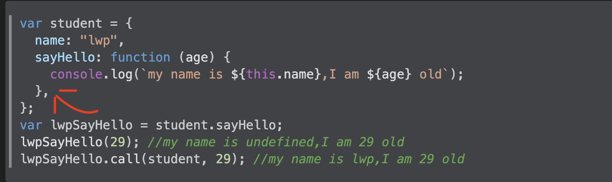

# call、apply、bind 的实现

call 和 apply 只有传参的区别，call、apply 和 bind 的区别是 bind 不会立即执行函数，而 call、apply 会立即执行
因此我们先实现 call，再实现 apply，最后用 call 或者 apply 实现 bind

# call 实现

首先先用这个例子复习一下 call 的功能

```js
var student = {
  name: "lwp",
  sayHello: function (age) {
    console.log(`my name is ${this.name},I am ${age} old`);
  },
};
var lwpSayHello = student.sayHello;
lwpSayHello(29); //my name is undefined,I am 29 old
lwpSayHello.call(student, 29); //my name is lwp,I am 29 old
```

首先实现功能

```js
Function.prototype.myCall = function (context, ...args) {
  var context = context || globalThis; //globalThisl可能是浏览器的window也可能是node的global
  context.fn = this;
  const result = context.fn(...args);
  delete context.fn;
  return result;
};
```

解答：
比较不好理解的是这句`context.fn = this;`，而这句话是实现 call 的核心
为了更好理解 `context.fn`,我们这样写

```js
Function.prototype.myCall = function (context, ...args) {
  var context = context || globalThis; //globalThisl可能是浏览器的window也可能是node的global
  var fn = this;
  const result = fn(...args);
  return result;
};
```

然后你会发现 this 指向是错误的，可以执行 call.js 的代码，查看效果

现在我开始一步一步解析代码

```js
//以这个例子为例
var lwpSayHello = student.sayHello;
lwpSayHello.call(student, 29)
//我们需要做的就是让sayHello里面的this指向student
context.fn = this;
//那么，这句代码我们可以理解为两个步骤
//第一步 把student代入到context
context=student={
    name: "lwp",
    sayHello: function (age) {
        console.log(`my name is ${this.name},I am ${age} old`);
  },
}
//第二步，把this代入，谁调用this，this指向谁，lwpSayHello.call，所以this指向lwpSayHello
context={
    name: "lwp",
    sayHello: function (age) {
        console.log(`my name is ${this.name},I am ${age} old`);
    }
    fn:lwpSayHello
}
//第三步，把lwpSayHello拷贝进去
context={
    name: "lwp",
    sayHello: function (age) {
        console.log(`my name is ${this.name},I am ${age} old`);
    }
    fn:function (age) {
        console.log(`my name is ${this.name},I am ${age} old`);
  }
}
//最后我们再理解myCall里面的这句话
const result = context.fn(...args)
//因此this.name就能正确变成lwp
//总结一下，借助context.fn是为了改变this指向
```

如果你还理解不了，可以到 call.js 执行一下代码


把例子里面的对象代入到这两行，或者这两行打一下断点，应该就能理解了

还可以这样理解


想要让 this 指向 student，那么在 student 去增加一个属性 fn，把函数赋值给 fn，调用完成之后再删除，那么在调用函数的时候，调用函数的对象就是 student，那么在函数内部访问的 this 也就是 student

当时我也理解不了为什么要用 context.fn,看了这个视频才恍然大悟的，所以如果看了我的解释还看不懂，你可以看视频：https://www.bilibili.com/video/BV15s4y167X3/?vd_source=1717bca8aebff18ca2591bd114c54e3f

也可以按照我的思路，自己写一下代码，用例子执行一下去理解

这里面还有很多问题，比如说 fn 会不会覆盖，那么我们这里可以借助 symbol

```js
Function.prototype.myCall = function (context, ...args) {
  var context = context || globalThis; //globalThisl可能是浏览器的window也可能是node的global
  const key = Symbol("changeThis");
  context[key] = this;
  const result = context[key](...args);
  delete context.fn;
  return result;
};
```

但是仍然有问题，具体可以看 call2.js
最后满分代码

```js
Function.prototype.myCall = function (context, ...args) {
  var context = context || globalThis; //globalThisl可能是浏览器的window也可能是node的global
  const key = Symbol("changeThis");
  Object.defineProperty(context, key, {
    enumerable: false,
    value: this,
  });
  delete context[key];
  const result = context[key](...args);
  return result;
};
```
但是如果第一个参数是null或者基础类型，就错了。
在原生call里，如果第一个参数是null则为全局，如果是基础类型，就变成引用类型。
```js
Function.prototype.myCall = function (context, ...args) {
  var context = context ==null? globalThis:Object(context); //globalThisl可能是浏览器的window也可能是node的global
  const key = Symbol("changeThis");
  Object.defineProperty(context, key, {
    enumerable: false,
    value: this,
  });
  delete context[key];
  const result = context[key](...args);
  return result;
};
```
到此为止 call 就实现了，接下来实现 apply 和 bind 也会变得非常简单

### apply

```js
Function.prototype.myApply = function (context, args) {
 var context = context ==null? globalThis:Object(context);
  const key = Symbol("changeThis");
  Object.defineProperty(context, key, {
    enumerable: false,
    value: this,
  });
  delete context[key];
  const result = context[key](...args);
  return result;
};
```

### bind

```js
Function.prototype.myBind = function (context, ...args) {
  var context = context ==null? globalThis:Object(context);
  const that = this;
  return function (...innerArgs) {
    that.apply(context, [...args, innerArgs]);
  };
};
```

但是如果遇到 new，就会出现问题
因此最终代码

```js
Function.prototype.myBind = function (context, ...args) {
  const _context = context || globalThis; //globalThisl可能是浏览器的window也可能是node的global
  const that = this;
  return function F(...innerArgs) {
    //因为这里返回一个函数，可以new fn，所以需要判断一下
    return that.apply(this instanceof F ? this : _context, [
      ...args,
      innerArgs,
    ]);
  };
};
```

具体过程可以看 bind2.js
